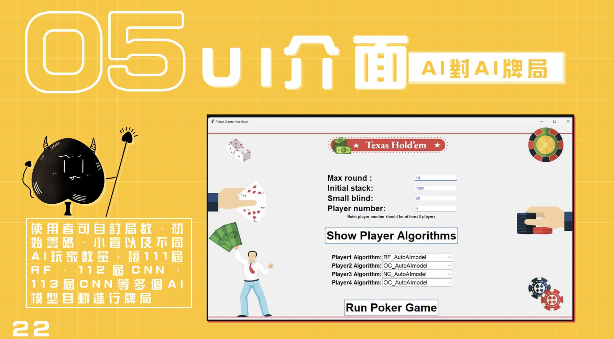

<div align="center">

[إنجليزي](./README.en.md)\|[الصينية المبسطة](./README.zh-CN.md)\|[العربية](./README.ar.md)\|[فرنسي](./README.fr.md)\|[اليابانية](./README.ja.md)

</div>
<div align="center">
  <h1>AutoAI</h1>
  <a href='#-目錄結構'>
    
  </a>
  <p>自動化AI德州撲克牌局</p>
  <p>
    <a href="https://youtu.be/sFaKtDhwvUw?feature=shared">演示 Demo</a> 
  </p>
</div>

## 📁 هيكل الدليل

### 🎮 محرك البوكر

-   المشاريع ذات الصلة
-   [com.PyPokerEngine](https://github.com/ishikota/PyPokerEngine)

### 📊 مخطط الاختبار

-   3 لاعبين
-   4players

### 📋 النتيجة

-   [فيديو تجريبي](https://youtu.be/sFaKtDhwvUw?feature=shared)

### 💾store_data_set

-   **chart.py**
    -   سيستخدم اللاعب الموجود في الموضع 0 هذه الفئة لتخزين المخططات وعرضها
    -   تخزين نتائج الاختبار من AutoAI.py
-   **data_set.py**
    -   (ستقوم موديلات NC فقط باستدعاء الوظائف لتخزين بيانات اللعبة)
-   **NC_3_players_data_set.csv**
    -   احفظ بيانات NC للعب ألعاب البوكر لثلاثة لاعبين
-   **NC_4_players_data_set.csv**
    -   قم بتخزين بيانات NC للعب ألعاب البوكر لأربعة لاعبين

### 🤖 نماذج الذكاء الاصطناعي

-   **NCmodel**: نموذج CNN AI (تدريب فردي على مجموعات البيانات المكونة من 3 أشخاص و4 أشخاص)
-   **NC2model**: نموذج CNN AI (تدريب مختلط 3 + 4 أشخاص)
-   **OCmodel**: نموذج الذكاء الاصطناعي المدرب من CNN
-   **نموذج الترددات اللاسلكية**: نموذج الذكاء الاصطناعي الذي تم تدريبه بواسطة غابة عشوائية

### 🎯 AutoAI.py

-   قم بتشغيل البرنامج الرئيسي لواجهة اللعبة
-   للعرض

## ⚙️ كيفية التنفيذ؟

1.  قم بتثبيت الوحدة في require.txt

```bash
pip install -r requirement.txt
```

(قد يكون ملف Requirement.txt مفقودًا في بعض الحزم، يرجى تثبيت كافة الحزم المطلوبة الأخرى من رسالة الخطأ)

2.  إذا أرشيف AutoAI**لا**تم التثبيت في ف:\\، يرجى تعديل المسار التالي

### قم بتعديل المسار في ملف Python التالي

#### NC_AutoAImodel.py

```python
def predict(self):
    if self.get_players()==3:
        with open('F:\\AutoAI\\NCmodel\\model-3p\\model3.config', 'r') as json_file: #路徑
            json_string = json_file.read()
        model = Sequential()
        model = model_from_json(json_string)
        model.load_weights('F:\\AutoAI\\NCmodel\\model-3p\\model3.weight', by_name=False) #路徑
    elif self.get_players()==4:
        with open('F:\\AutoAI\\NCmodel\\model-4p\\model4.config', 'r') as json_file: #路徑
            json_string = json_file.read()
        model = Sequential()
        model = model_from_json(json_string)
        model.load_weights('F:\\AutoAI\\NCmodel\\model-4p\\model4.weight', by_name=False) #路徑
```

#### NC2_AutoAImodel.py

```python
def predict(self):
    with open('F:\\AutoAI\\NCmodel\\model-3+4p\\model3+4.config', 'r') as json_file: #路徑
            json_string = json_file.read()
    model = Sequential()
    model = model_from_json(json_string)
    model.load_weights('F:\\AutoAI\\NCmodel\\model-3+4p\\model3+4.weight', by_name=False) #路徑
```

#### OC_AutoAImodel.py

```python
def predict(self):
    with open('F:\\AutoAI\\OCmodel\\model.config', 'r') as text_file: #路徑
        json_string = text_file.read()
    model = Sequential()
    model = model_from_json(json_string)
    model.load_weights('F:\\AutoAI\\OCmodel\\model.weight', by_name=False) #路徑
```

#### RF_AutoAImodel.py

```python
def predict(self):
    model = joblib.load(r"F:\AutoAI\RFmodel\my_random_forest.joblib") #路徑
```

3.  ترجمة وتنفيذ AutoAI.py
4.  قم بتعيين القيمة الأولية للعبة (يجب أن تكون أكبر من الرهان المبدئي الصغير)
5.  انقر فوق الزر إظهار خوارزمية المشغل
6.  حدد الخوارزمية المطلوبة
7.  انقر فوق الزر تشغيل لعبة البوكر

## ⚠️ ملاحظات

-   🚫 لا تختر نفس الذكاء الاصطناعي في نفس اللعبة
-   ⚠️ يجب أن يكون عدد اللاعبين 3-4 أشخاص
-   ⏳ يستغرق تنفيذ اللعبة بعض الوقت، ويمكنك التحقق من التقدم في محطة VS Code.
