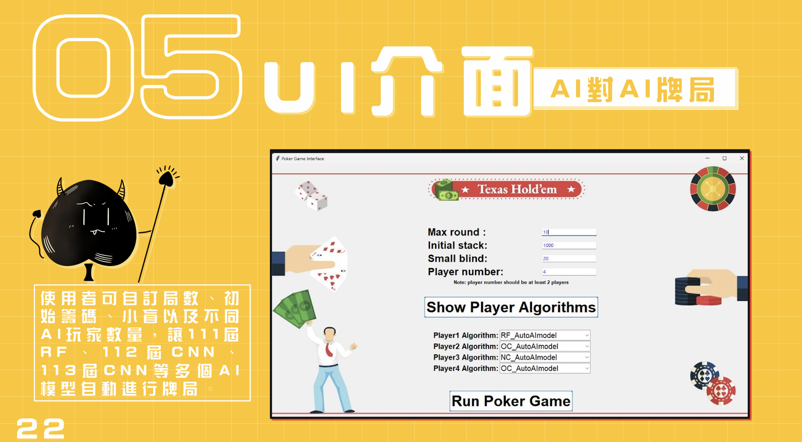

<div align="center">

[英语](./README.en.md)\|[简体中文](./README.zh-CN.md)\|[阿拉伯](./README.ar.md)\|[法语](./README.fr.md)\|[日本人](./README.ja.md)

</div>
<div align="center">
  <h1>AutoAI</h1>
  <a href='#-目錄結構'>
    
  </a>
  <p>自動化AI德州撲克牌局</p>
  <p>
    <a href="https://youtu.be/sFaKtDhwvUw?feature=shared">演示 Demo</a> 
  </p>
</div>

## 📁 目录结构

### 🎮 扑克引擎

-   相关专案
-   [PyPoker引擎](https://github.com/ishikota/PyPokerEngine)

### 📊 测试图

-   3人
-   4人

### 📋 结果

-   [演示视频](https://youtu.be/sFaKtDhwvUw?feature=shared)

### 💾 存储数据集

-   **chart.py**
    -   位置0的玩家将使用此类别来储存与显示图表
    -   儲存來自AutoAI.py的測試結果
-   **data_set.py**
    -   (仅NC模型会呼叫函数来储存游戏资料)
-   **NC_3_players_data_set.csv**
    -   储存NC玩3人扑克游戏的资料
-   **NC_4_players_data_set.csv**
    -   储存NC玩4人扑克游戏的资料

### 🤖 人工智能模型

-   **数控模型**: CNN AI模型 (3人、4人资料集个别训练)
-   **NC2型号**: CNN AI模型(3+4人混合训练)
-   **OCmodel**: CNN 训练的AI模型
-   **射频模型**:随机森林训练的AI模型

### 🎯 AutoAI.py

-   启动游戏介面的主程式
-   用于展示

## ⚙️ 如何执行?

1.  安装requirement.txt中的模组

```bash
pip install -r requirement.txt
```

(requirement.txt可能缺少某些套件，请从错误讯息安装所有其他需要的套件)

2.  如果AutoAI檔案**不是**安装在F:\\，请修改以下路径

### 在以下Python档案中修改路径

#### NC_AutoAImodel.py

```python
def predict(self):
    if self.get_players()==3:
        with open('F:\\AutoAI\\NCmodel\\model-3p\\model3.config', 'r') as json_file: #路徑
            json_string = json_file.read()
        model = Sequential()
        model = model_from_json(json_string)
        model.load_weights('F:\\AutoAI\\NCmodel\\model-3p\\model3.weight', by_name=False) #路徑
    elif self.get_players()==4:
        with open('F:\\AutoAI\\NCmodel\\model-4p\\model4.config', 'r') as json_file: #路徑
            json_string = json_file.read()
        model = Sequential()
        model = model_from_json(json_string)
        model.load_weights('F:\\AutoAI\\NCmodel\\model-4p\\model4.weight', by_name=False) #路徑
```

#### NC2_AutoAImodel.py

```python
def predict(self):
    with open('F:\\AutoAI\\NCmodel\\model-3+4p\\model3+4.config', 'r') as json_file: #路徑
            json_string = json_file.read()
    model = Sequential()
    model = model_from_json(json_string)
    model.load_weights('F:\\AutoAI\\NCmodel\\model-3+4p\\model3+4.weight', by_name=False) #路徑
```

#### OC_AutoAImodel.py

```python
def predict(self):
    with open('F:\\AutoAI\\OCmodel\\model.config', 'r') as text_file: #路徑
        json_string = text_file.read()
    model = Sequential()
    model = model_from_json(json_string)
    model.load_weights('F:\\AutoAI\\OCmodel\\model.weight', by_name=False) #路徑
```

#### RF_AutoAImodel.py

```python
def predict(self):
    model = joblib.load(r"F:\AutoAI\RFmodel\my_random_forest.joblib") #路徑
```

3.  编译并执行AutoAI.py
4.  设定游戏初始值(应大于小盲注)
5.  点击Show Player Algorithm按钮
6.  选择想要的演算法
7.  点击Run Poker Game按钮

## ⚠️ 注意事项

-   🚫 不要在同一场游戏中选择相同的AI
-   ⚠️ 玩家人数应为3-4人
-   ⏳ 执行游戏需要一些时间，可以在VS Code终端机中查看进度
